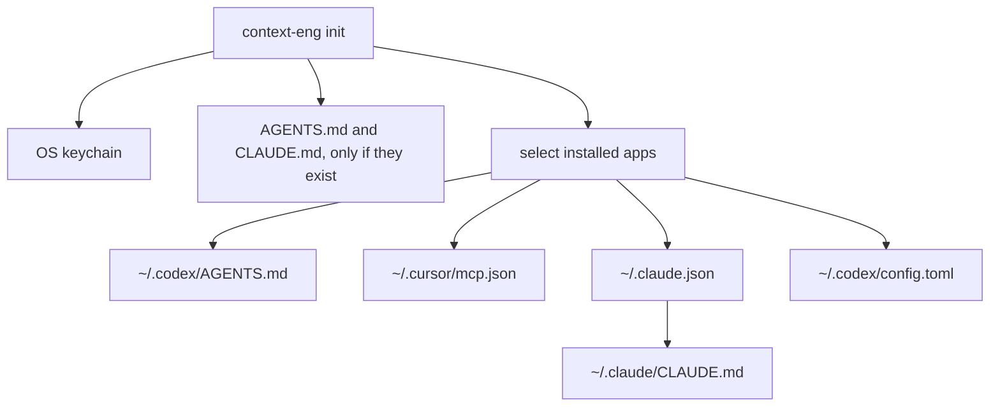
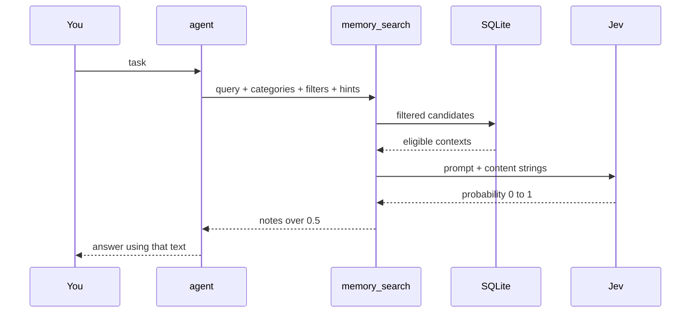
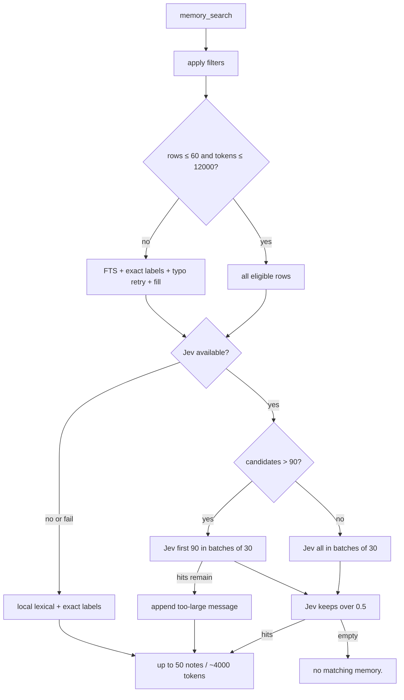

# context-eng

Local project memory router for Codex and Claude Code. Memories live in one SQLite database per each category, with SQLite FTS5 for local retrieval and TypeSafe Jev filtering for semantic relevance.

## Use

Node.js 20 or newer. Run this from an existing project directory, or pass `--project` pointing to one. From a checkout of this repo, `npm install`, `npm run build`, then `npm run init` does the same thing.

```bash
npx -y context-eng init
pnpm dlx context-eng init
context-eng init --project /path/to/repo
```

`init` asks for a TypeSafe API key. The prompt is hidden. Press Enter to skip. A saved key is kept if you press Enter again; type a new key to replace it. The key goes in the OS keychain (macOS Keychain, Windows Credential Manager, or libsecret), not into the project.

In a terminal, `init` lists Cursor, Claude Code, and Codex. Installed ones start selected. Space turns one off. Enter writes a user-level MCP server only for the ones left selected. A different existing `context-eng` server needs an explicit yes before replacement. Without a terminal, `init` skips global instructions and editor servers unless you pass `--yes`; `--yes` adds missing servers but never replaces a different one. Restart an app after adding its server.



You do not start the server yourself. Cursor, Claude Code, or Codex runs `context-eng mcp`. With no `--project`, the server is global until a tool passes `projectPath` or calls `memory_bind`.

### Project and global

Two different splits:

| | Project | Global |
| --- | --- | --- |
| Memory | This repo only, under `~/.context/projects/` | Every repo, under `~/.context/global/` |
| Instructions | Files inside the repo | Files in your home directory, used by every repo |

`memory_search` with `filters.scope` `project`, `global`, or `both` chooses the memory side. The files below are the instruction side.

### Files `init` edits

Instruction files (`AGENTS.md`, `CLAUDE.md`, and the rule files below) keep your other text. `init` replaces only the block between `<!-- context-eng:start -->` and `<!-- context-eng:end -->`. The MCP config files are updated in place and keep other servers.

| File | When | What it does |
| --- | --- | --- |
| OS keychain `context-eng` / `typesafe-api-key` | Always | Stores the TypeSafe key for this login |
| `<project>/AGENTS.md` | Only if that file already exists | Tells Codex, in this repo, to use the memory tools |
| `<project>/CLAUDE.md` | Only if that file already exists | Tells Claude Code, in this repo, to use the memory tools |
| `~/.codex/AGENTS.md` | Terminal or `--yes` | Same instructions for every Codex session |
| `~/.claude/CLAUDE.md` | Claude server added or already matching, or `--claude-only` | Same instructions for every Claude Code project |
| `~/.cursor/mcp.json` | Cursor selected | Starts the server for every Cursor project. No `--project` |
| `~/.claude.json` | Claude selected | Same for every Claude Code project. This is the file `claude mcp add --scope user` writes |
| `~/.codex/config.toml` | Codex selected | Adds `[mcp_servers.context-eng]` only. Codex may later add `[mcp_servers.context-eng.tools.*]` approval lines itself |

`<project>` is `--project`, or the current directory when you omit it. It must already exist. Running `init` from `~` uses your home directory as `<project>`. It does not create `~/AGENTS.md` or `~/CLAUDE.md` when those files are absent. Claude's user-level MCP server is in `~/.claude.json`; `init` does not create a project `.mcp.json`.

### One app, or only the instruction files

These skip the key prompt and the MCP server write. They only update instruction files.

```bash
context-eng init --codex-only
context-eng init --cursor-only --scope global
context-eng init --cursor-only --project /path/to/repo
context-eng init --claude-only --scope both --project /path/to/repo
```

| Command | Global file | Project file |
| --- | --- | --- |
| `--codex-only` | `~/.codex/AGENTS.md` | none |
| `--cursor-only` | `~/.cursor/rules/context-eng-memory.mdc` | `<project>/.cursor/rules/context-eng-memory.mdc` |
| `--claude-only` | `~/.claude/CLAUDE.md` | `<project>/.claude/rules/context-eng-memory.md` |

`--scope` is `global`, `project`, or `both`. With no `--project`, scope defaults to `global`. With `--project` and no `--scope`, scope defaults to `project`. `project` and `both` need `--project`.

`context-eng mcp` reads the keychain key when `TYPESAFE_API_KEY` is unset. Set `TYPESAFE_API_KEY` to override it. Set it empty to force local FTS5 search. `CONTEXT_ENG_HOME` overrides the default `~/.context` storage root.

## Search behavior

`memory_search` can omit categories to search every category available in the selected scope. Supplying one to four categories narrows the search. Filters are applied before retrieval:

- An MCP started without `--project` has no project layout. Global-only search/create and the global portions of map/category discovery still work. Project or both-scope operations return `PROJECT_NOT_BOUND` until you retry that call with `projectPath` or call `memory_bind`; id-based tools require `memory_bind` because they do not accept `projectPath`.
- With `TYPESAFE_API_KEY`, searches with at most 60 eligible rows and 12,000 eligible tokens send every row to Jev. Larger searches merge FTS5 matches, exact hint-label matches, one conservative typo retry, and priority fill; Jev evaluates the first 90 in batches of 30.
- Optional `hints.topics`, `hints.tags`, `hints.links`, and `hints.categories` boost candidate selection but never act as hard filters. Exact label matches are preserved in the local fallback.
- Without the key, or when Jev fails or exceeds its 20-second request deadline (`DEFAULT_JEV_TIMEOUT_MS`, locked), the tool uses local lexical and exact-label retrieval.
- At most 50 relevant contexts and approximately 4000 tokens are returned after a short retrieval mode/count line.

Jev receives only the agent prompt and an array of memory-content strings; category, scope, importance, IDs, and other memory metadata stay local.







## Requirements and install

Node.js 20 or newer.

One command, after this package is published. It asks for the TypeSafe key, then detects Cursor, Claude Code, and Codex. In a terminal the installed ones start selected. Space turns one off, Enter confirms, and init writes a user-level MCP server only for the ones left selected. A different existing `context-eng` setup needs confirmation before replacement. In a non-terminal session, use `--yes` to add missing servers without replacing different ones. That server is `npx -y context-eng mcp` when `npx` is on PATH, otherwise `pnpm dlx context-eng mcp`. Global configs omit `--project`.

```bash
npx -y context-eng init
```

```bash
pnpm dlx context-eng init
```

From this repo:

```bash
npm install
npm run build
npm run init
```


## Init and server

```bash
npm run init
node dist/cli-entry.js init --project /path/to/repo
```

`context-eng init` asks for a TypeSafe API key in the terminal and stores it in the OS keychain (macOS Keychain, Windows Credential Manager, or libsecret). The prompt is hidden. Press Enter to skip. Run init again to replace a saved key: enter the new key, or press Enter to keep the current one. The key is not written into the project.

`context-eng mcp` reads that key when `TYPESAFE_API_KEY` is unset. Set `TYPESAFE_API_KEY` to override the keychain. Set it to an empty value to force local FTS5 search.

Run with Jev after the key is saved:

```bash
node dist/cli-entry.js mcp --project /path/to/repo
```

Run with `TYPESAFE_API_KEY` empty for local FTS5-only search:

```bash
TYPESAFE_API_KEY= node dist/cli-entry.js mcp --project /path/to/repo
```

Omitting `--project` is supported for a global-only server. It does not resolve or store `process.cwd()` as a project layout; bind explicitly before project access.

Project-path resolution elsewhere still uses explicit input, then `CONTEXT_ENG_PROJECT`, then the current working directory. The `mcp` command intentionally treats an omitted `--project` as unbound instead of accepting that fallback as a binding. `CONTEXT_ENG_HOME` overrides the default `~/.context` storage root.

## Memory search

`query` is required. `projectPath` is required when no project is bound and the scope is `project` or `both` (the default). If the tool returns `PROJECT_NOT_BOUND`, retry the same call with `projectPath`. Categories, filters, hints, sort, and limit are optional.

```json
{
  "projectPath": "/path/to/repo",
  "query": "fix the image export memory leak",
  "categories": ["mistake", "decision"],
  "filters": {
    "scope": "both",
    "minImportance": 0.6,
    "subject": "canvas export",
    "topics": { "values": ["browser memory"], "match": "any" },
    "tags": { "values": ["blob-url"], "match": "all" },
    "links": { "values": ["cli.ts"], "match": "any" },
    "time": { "field": "updated", "preset": "this_month" }
  },
  "hints": {
    "topics": ["browser memory"],
    "tags": ["blob-url"],
    "links": ["cli.ts"],
    "categories": ["mistake"]
  },
  "sort": { "by": "relevance", "order": "desc" },
  "limit": 50
}
```

Omit `categories` to search every category in the selected scope. Omit `projectPath` when the server started with `--project`, you already called `memory_bind`, or `filters.scope` is `global`.

Time supports `this_week` (Monday to now), `this_month`, or inclusive ISO-8601 `from`/`to` ranges. Filter topics, tags, and links support `any` or `all` and remove non-matches. Hint topics, tags, links, and categories only influence candidate ordering. Links are opaque cross-references rather than URLs specifically: at most ten values, each at most 64 characters.

## Tools


| Tool                     | Contract                                                                                                                                                                                                       |
| ------------------------ | -------------------------------------------------------------------------------------------------------------------------------------------------------------------------------------------------------------- |
| `memory_search`          | `query` is required. Pass `projectPath` when unbound and scope is `project` or `both`; on `PROJECT_NOT_BOUND`, retry with `projectPath`. Other fields are optional. Hints boost without hard filtering.        |
| `memory_create`          | Creates a missing custom category on first write. Near-duplicate names require a second call with `confirmNewCategory: true`; built-in durable categories auto-promote and custom categories start in staging. |
| `memory_list_categories` | Lists global names, and project names when a project is bound. Omission returns global only while unbound. Explicit `scope: "project"` needs `projectPath` or `memory_bind`.                                   |
| `memory_edit`            | Requires `currentCategory`; an optional replacement `category` moves the row between category databases. Creating a near-duplicate destination requires `confirmNewCategory: true`.                            |
| `memory_map`             | Lists categories, counts, staging, aligned `lines_ids`, and map paths. Accepts `scope` (`both`, `global`, or `project`) and `projectPath`.                                                                     |
| `memory_bind`            | Binds the server to another project storage catalog.                                                                                                                                                           |
| `memory_promote`         | Requires category and ID; moves a staging memory into search.                                                                                                                                                  |
| `memory_demote`          | Requires category and ID; moves a searchable memory to staging.                                                                                                                                                |
| `memory_delete`          | Requires category and ID; deletes staging rows only.                                                                                                                                                           |


## Data layout and migration

```text
~/.context/
  global/
    catalog.db
    categories/<slug>-<hash>.db
  projects/<project-key>/
    catalog.db
    categories/<slug>-<hash>.db
    map.md
    map.json
```

On first open, existing single-database memories are copied into staged category databases, validated, activated, and marked migrated. IDs, timestamps, tags, importance, active state, and staging state are preserved; the legacy database is not deleted.

Category names are Unicode-normalized and case-insensitive for lookup. Safe slug-and-hash filenames prevent a category name from becoming a filesystem path. If at least 80% of a new name matches a built-in or same-scope registered category after separators are removed, `memory_create` or a category-changing `memory_edit` returns `NEAR_CATEGORY` without writing. Separator-only variants such as `batch-probe` and `batch_probe` are also treated as matches. The agent can use the suggested category or make a second call with `confirmNewCategory: true`. Built-in categories keep their existing auto-promotion behavior; custom categories have no rename or delete lifecycle in this version.

## Checks

```bash
npm test
npm run typecheck
npm run typecheck:test
npm run lint
```


## Related docs

- [Memory tool rules](system_prompts/rules.md) — agent contract for bind, search, write, promote, and delete
