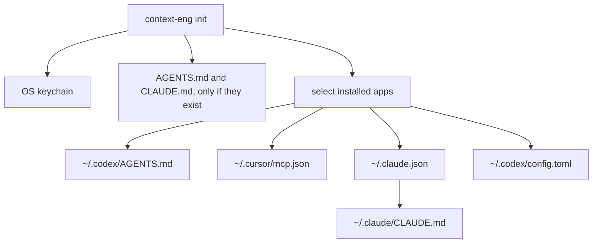
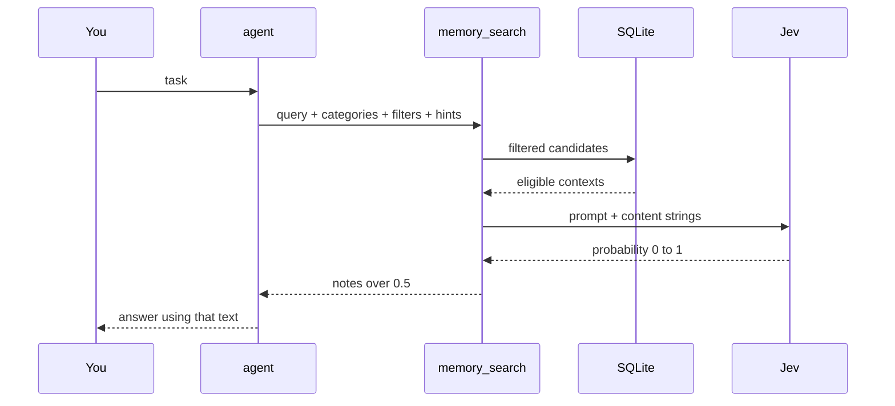
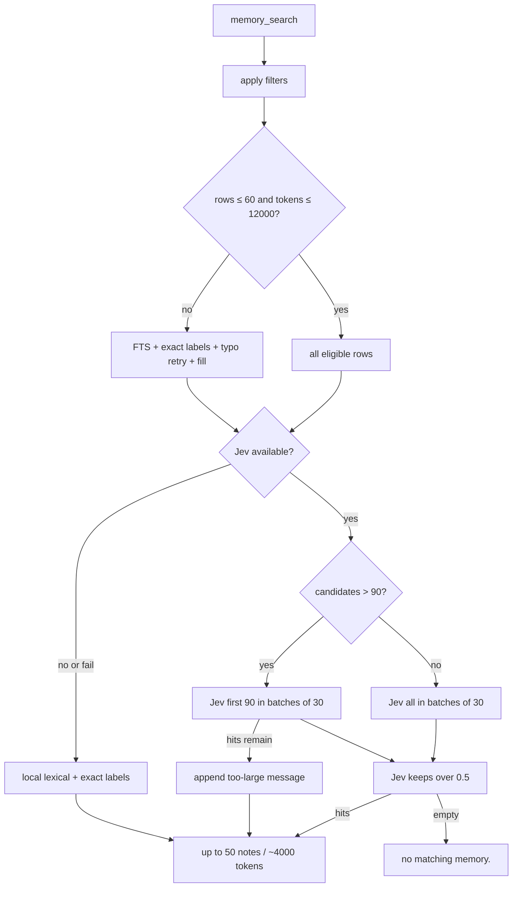

# context-eng

Local project memory router for Codex and Claude Code. Memories live in one SQLite database per each category, with SQLite FTS5 for local retrieval and TypeSafe Jev filtering for semantic relevance.

## Use

- Requires Node.js 20 or newer.
- Run the command from within your project repository, not from your home directory.

```bash
npx -y context-eng init
```

```bash
pnpm dlx context-eng init
```

To set up a different folder than the one you are in:

```bash
context-eng init --project /path/to/repo
```

`init` asks for a TypeSafe API key. The prompt is hidden. Press Enter to skip. A saved key is kept if you press Enter again; type a new key to replace it. The key goes in the OS keychain (macOS Keychain, Windows Credential Manager, or libsecret), not into the project.

In a terminal, `init` lists Cursor, Claude Code, and Codex. Installed ones start selected. Space turns one off. Enter writes a user-level MCP server only for the ones left selected. A different existing `context-eng` server needs an explicit yes before replacement. Without a terminal, `init` skips global instructions and editor servers unless you pass `--yes`; `--yes` adds missing servers but never replaces a different one. Restart an app after adding its server.


```mermaid
flowchart TD
  init["context-eng init"] --> key["OS keychain"]
  init --> project["AGENTS.md and CLAUDE.md, only if they exist"]
  init --> pick["select installed apps"]
  pick --> codexRules["~/.codex/AGENTS.md"]
  pick --> cursor["~/.cursor/mcp.json"]
  pick --> claude["~/.claude.json"]
  claude --> claudeRules["~/.claude/CLAUDE.md"]
  pick --> codex["~/.codex/config.toml"]
```


You do not start the server yourself. Cursor, Claude Code, or Codex runs `context-eng mcp`. With no `--project`, the server is global until a tool passes `projectPath` or calls `memory_bind`.

### Project and global

Two different splits:


|              | Project                                      | Global                                           |
| ------------ | -------------------------------------------- | ------------------------------------------------ |
| Memory       | This repo only, under `~/.context/projects/` | Every repo, under `~/.context/global/`           |
| Instructions | Files inside the repo                        | Files in your home directory, used by every repo |


`memory_search` with `filters.scope` `project`, `global`, or `both` chooses the memory side. The files below are the instruction side.

### Files `init` edits

Instruction files (`AGENTS.md`, `CLAUDE.md`, and the rule files below) keep your other text. `init` replaces only the block between `<!-- context-eng:start -->` and `<!-- context-eng:end -->`. The MCP config files are updated in place and keep other servers.


| File                                           | When                                                        | What it does                                                                                                         |
| ---------------------------------------------- | ----------------------------------------------------------- | -------------------------------------------------------------------------------------------------------------------- |
| OS keychain `context-eng` / `typesafe-api-key` | Always                                                      | Stores the TypeSafe key for this login                                                                               |
| `<project>/AGENTS.md`                          | Only if that file already exists                            | Tells Codex, in this repo, to use the memory tools                                                                   |
| `<project>/CLAUDE.md`                          | Only if that file already exists                            | Tells Claude Code, in this repo, to use the memory tools                                                             |
| `~/.codex/AGENTS.md`                           | Terminal or `--yes`                                         | Same instructions for every Codex session                                                                            |
| `~/.claude/CLAUDE.md`                          | Claude server added or already matching, or `--claude-only` | Same instructions for every Claude Code project                                                                      |
| `~/.cursor/mcp.json`                           | Cursor selected                                             | Starts the server for every Cursor project. No `--project`                                                           |
| `~/.claude.json`                               | Claude selected                                             | Same for every Claude Code project. This is the file `claude mcp add --scope user` writes                            |
| `~/.codex/config.toml`                         | Codex selected                                              | Adds `[mcp_servers.context-eng]` only. Codex may later add `[mcp_servers.context-eng.tools.*]` approval lines itself |


`<project>` is `--project`, or the current directory when you omit it. It must already exist. Running `init` from `~` uses your home directory as `<project>`. It does not create `~/AGENTS.md` or `~/CLAUDE.md` when those files are absent. Claude's user-level MCP server is in `~/.claude.json`; `init` does not create a project `.mcp.json`.

### One app, or only the instruction files

These skip the key prompt and the MCP server write. They only update instruction files.

```bash
context-eng init --codex-only
context-eng init --cursor-only --scope global
context-eng init --cursor-only --project /path/to/repo
context-eng init --claude-only --scope both --project /path/to/repo
```


| Command         | Global file                              | Project file                                     |
| --------------- | ---------------------------------------- | ------------------------------------------------ |
| `--codex-only`  | `~/.codex/AGENTS.md`                     | none                                             |
| `--cursor-only` | `~/.cursor/rules/context-eng-memory.mdc` | `<project>/.cursor/rules/context-eng-memory.mdc` |
| `--claude-only` | `~/.claude/CLAUDE.md`                    | `<project>/.claude/rules/context-eng-memory.md`  |


`--scope` is `global`, `project`, or `both`. With no `--project`, scope defaults to `global`. With `--project` and no `--scope`, scope defaults to `project`. `project` and `both` need `--project`.

`context-eng mcp` reads the keychain key when `TYPESAFE_API_KEY` is unset. Set `TYPESAFE_API_KEY` to override it. Set it empty to force local FTS5 search. `CONTEXT_ENG_HOME` overrides the default `~/.context` storage root.

## Recall from the agent prompt box

Prompt-box recall supports local Codex and Claude Code on macOS and Linux. A `UserPromptSubmit` command hook fetches memories before the model processes the prompt. It calls the existing memory engine directly, so the model does not need to choose `memory_search` or run a terminal command.

After publishing a release that includes these integrations, install a durable copy and configure recall:

```sh
npm install -g context-eng@latest
context-eng init --recall manual
```

Setup selects detected Claude/Codex hosts. Use `--harness claude` or `--harness codex` to target one directly. This recall-only setup does not configure MCP or prompt for a key; ordinary `context-eng init` still handles MCP and the optional key. Temporary `npx`/`pnpm dlx` runtimes are rejected for hook installation because their cached files can disappear. A stable source checkout also works for development.

Restart the selected host after installation. Codex requires review and trust of the hook using `/hooks`; project-local Codex hooks also require trusting the project. Then invoke recall from the prompt box:

```text
Claude Code: /recall Fix login
Codex:       $recall Fix login
```

Codex also offers recall through its skill picker. The command displays fetched memories with their category, project, and update date, then waits. It does not start the task described by the query. If the hook is missing, the skill reports the setup problem instead of quietly falling back to model-driven retrieval.

To fetch memories before every prompt while keeping manual recall available:

```sh
context-eng init --recall automatic
```

Automatic recall adds context quietly, including an empty/error status to avoid a second lookup. It attempts semantic evaluation with a 1.5-second request deadline, falls back to local retrieval on failure, returns at most five whole memories within an approximate 1800-token budget for the exact `additionalContext` text supplied to the model, and has a five-second host timeout. The outer hook JSON is only transport and does not consume this budget. The existing MCP relevance timeout is unchanged. With a configured relevance key, automatic mode sends each prompt and candidate memory text to that service. Add `--local` during setup to skip the keychain and external service.

Disable our integration with `context-eng init --recall off`. Setup preserves unrelated settings, hooks, and skills. Before it changes the recall files, it records their contents and permissions; if a later file write or removal fails, it restores completed changes in reverse order. If another process changed a completed file first, setup preserves that newer content and reports the remaining partial change instead of overwriting it. Rollback also checks symbolic-link targets: if a link was redirected, it leaves the link and its new target untouched and reports the remaining partial change, even when the target contains identical text. A conflicting user-owned recall skill or malformed config is left unchanged. Repeating setup updates the owned handler without adding another one. Do not install both project and global recall for the same host; setup checks the current project's opposite scope and refuses a duplicate.

Global setup writes these files:

| Host | Hook configuration | Skill |
| --- | --- | --- |
| Claude Code | `~/.claude/settings.json` | `~/.claude/skills/recall/SKILL.md` |
| Codex | `~/.codex/hooks.json` | `~/.agents/skills/recall/SKILL.md` and `agents/openai.yaml` |

Use `--scope project --project /path/to/repo` for project setup. It writes `.claude/settings.local.json` or `.codex/hooks.json` and the corresponding skill directory inside that project. Project hooks bind to that root even from nested working directories. Global hooks use the event's current directory; use project setup when a nested directory should share the repository root's memory. Disabling uses the same scope/project flags as installation. Keep one installation scope per host across your projects.

Cursor's documented `beforeSubmitPrompt` hook cannot add memory context, so recall setup does not install a Cursor adapter. Remote/cloud hosts need the runtime and memory data in their own execution environment; installing locally does not deploy them there. Rerun setup after moving the checkout or changing the installed Node path.

### Test an unpublished checkout

For an existing throwaway project directory, install directly from this checkout without publishing or building:

```sh
node --import tsx src/cli-entry.ts init --recall manual --harness claude --scope project --project /path/to/test-project --local
node --import tsx src/cli-entry.ts init --recall manual --harness codex --scope project --project /path/to/test-project --local
```

Use the commands in each real host's prompt box with a topic already stored for that test project. Check hook delivery in the host's hook/debug view and verify the first response has the memory without a `memory_search` call. Switch to automatic mode and submit two different topics in succession to verify recall runs before both prompts. Finally disable the project integration and check unrelated hooks remain.

To configure both hooks for this checkout in Codex, run these commands from the repository root:

```sh
node --import tsx src/cli-entry.ts init --recall automatic --harness codex --scope project --project . --local
node --import tsx src/cli-entry.ts init --postsession on --harness codex --scope project --project .
```

This creates `.codex/hooks.json` with `UserPromptSubmit` for recall and `Stop` for the memory-saving pass. It also installs `.agents/skills/recall/SKILL.md` and `.agents/skills/recall/agents/openai.yaml`. These generated hooks use absolute paths to the local Node executable and checkout. Recall uses local word matching in this test setup. Postsession uses the working model and requires the context-eng `memory_create` and `memory_promote` tools to be connected and permitted.

1. Restart Codex or reopen the project. Open `/hooks` and review/trust both hook definitions. Project hooks also require project trust.
2. In this project, use the memory tools to save one known note, such as `The project test colour is violet.`, and confirm it is searchable. A fact mentioned only in chat is not yet a saved context-eng memory.
3. Open a fresh chat in the same project and type `$recall test colour`. The saved note should appear with its metadata, and the agent should wait. There should be no `memory_search` call before that first reply.
4. Open another fresh chat and ask `What is the project test colour?`. Automatic recall should supply the note before the first answer, without a model-triggered search for that answer.
5. For postsession, finish a task that establishes one new durable fact. Confirm that the Stop hook gives the working model one final save pass. If the fact was already saved during the task, a no-op is correct. Otherwise, check the memory-tool result and any required promotion, then retrieve the fact in a fresh chat. A lookup during this later saving pass is separate from the before-answer recall check.

For Claude Code, replace `--harness codex` with `--harness claude` in the two setup commands, restart Claude Code, and use `/recall test colour` in its prompt box. Claude project setup uses `.claude/settings.local.json` and `.claude/skills/recall/SKILL.md`.

To remove this project's hooks, use the same host, scope, and project flags with `--recall off` and `--postsession off`.

The focused automated checks use temporary homes/projects and do not install into your live host configuration:

```sh
npm run typecheck:test
npm test -- test/hooks.test.ts test/hook-install.test.ts test/engine.test.ts test/recall.test.ts test/mcp.test.ts
```

## Save a memory when a task finishes

The optional `postsession` hook uses the host's `Stop` event while the current model still has the conversation. It asks that same working model to make one final saving pass. It does not launch another model or call a summarisation API.

To try it from this unpublished checkout for the current project:

```sh
node --import tsx src/cli-entry.ts init --postsession on --harness codex --scope project --project .
```

Use `--harness claude` for Claude Code. Restart the host and, in Codex, review/trust the hook using `/hooks`. After a release containing this feature is installed durably, the equivalent command is `context-eng init --postsession on`. Use `--postsession off` with the same host/scope/project flags to remove just this hook; recall and other Stop handlers are preserved.

The host must have context-eng `memory_create` and `memory_promote` connected and permitted. Ordinary `context-eng init` handles MCP setup if needed. The saving pass checks whether the task is complete and whether a useful, verified claim was learned. It skips duplicates, secrets, temporary status, guesses, and tasks that forbid saving. It defaults to project scope and considers at most one new claim. When creation leaves that claim in staging, the model must promote it and confirm success before reporting it searchable.

This is a model-guided save, not a guaranteed database write. Missing tools, denied permissions, or a failed promotion are reported rather than bypassed. There is one extra model continuation, using the host's normal quota. If another Stop continuation is already active, `stop_hook_active` prevents chaining another save pass. Other Stop policies can also prevent continuation. The hook judges completion through the working model because a finished response can be a clarification or partial result. Closing or killing the host before this pass completes can prevent saving.

The handler reads only the bounded hook input, not the session transcript. Invalid input lets the task finish. The focused checks for this feature and the shared recall installer are:

```sh
npm run typecheck:test
npm test -- test/postsession.test.ts test/hook-install.test.ts
```

Live-host verification still needs an isolated Codex/Claude session with connected memory tools: complete a task with a new known fact, check that its memory is searchable, and verify that the saving pass stops rather than looping. Also check a task with no new learning creates nothing. These unit tests verify the protocol and configuration, not a real model's judgement or memory-tool execution.

## Recall memories from a terminal

Use `recall` before starting work in any agent. Enter the task you are about to give it, review the printed memories, and paste the useful context into your prompt. This command calls the memory engine directly; an agent does not need to choose an MCP tool.

```sh
context-eng recall --project /path/to/repo --query "Fix login"
```

From this source checkout, run the same command without building:

```sh
node --import tsx src/cli-entry.ts recall --project . --query "Fix login"
```

By default, `recall` searches promoted project and global memories. With no `--project`, it uses `CONTEXT_ENG_PROJECT` or the current directory. Pass the repository root explicitly when running from a subdirectory. `--scope project` or `--scope global` narrows the search; global-only recall does not bind a project. `--limit 5` lowers the maximum number of returned memories, within the existing 4000-token budget.

It uses the same semantic relevance check and local fallback as `memory_search`. `--local` skips the keychain and external service and uses local word matching only. The semantic service can take up to its existing 20-second request deadline before falling back. Printed memories include their update date, category, and project.

Standard output contains the memory context. Warnings and errors go to standard error. No matches is a successful result with a `no matching memory.` message; invalid inputs and retrieval failures exit with status 1. The command does not create or edit memory claims, but opening the engine can initialise storage, migrate older databases, and refresh maps as usual.

The terminal command itself does not install hooks. Use the prompt-box setup above for automatic or explicit in-agent recall. A session-start hook has no task query; task-specific recall runs on prompt submission.

## Search behavior

`memory_search` can omit categories to search every category available in the selected scope. Supplying one to four categories narrows the search. Filters are applied before retrieval:

- An MCP started without `--project` has no project layout. Global-only search/create and the global portions of map/category discovery still work. Project or both-scope operations return `PROJECT_NOT_BOUND` until you retry that call with `projectPath` or call `memory_bind`; id-based tools require `memory_bind` because they do not accept `projectPath`.
- With `TYPESAFE_API_KEY`, searches with at most 60 eligible rows and 12,000 eligible tokens send every row to Jev. Larger searches merge FTS5 matches, exact hint-label matches, one conservative typo retry, and priority fill; Jev evaluates the first 90 in batches of 30.
- Optional `hints.topics`, `hints.tags`, `hints.links`, and `hints.categories` boost candidate selection but never act as hard filters. Exact label matches are preserved in the local fallback.
- Without the key, or when Jev fails or exceeds its 20-second request deadline (`DEFAULT_JEV_TIMEOUT_MS`, locked), the tool uses local lexical and exact-label retrieval.
- At most 50 relevant contexts and approximately 4000 tokens are returned after a short retrieval mode/count line.

Jev receives only the agent prompt and an array of memory-content strings; category, scope, importance, IDs, and other memory metadata stay local.


```mermaid
sequenceDiagram
  participant You
  participant agent
  participant MCP as memory_search
  participant SQLite
  participant Jev

  You->>agent: task
  agent->>MCP: query + categories + filters + hints
  MCP->>SQLite: filtered candidates
  SQLite-->>MCP: eligible contexts
  MCP->>Jev: prompt + content strings
  Jev-->>MCP: probability 0 to 1
  MCP-->>agent: notes over 0.5
  agent-->>You: answer using that text
```



```mermaid
flowchart TD
  search[memory_search] --> filters[apply filters]
  filters --> size{rows ≤ 60 and tokens ≤ 12000?}
  size -->|yes| all[all eligible rows]
  size -->|no| rank[FTS + exact labels + typo retry + fill]
  all --> jev{Jev available?}
  rank --> jev
  jev -->|no or fail| fts[local lexical + exact labels]
  jev -->|yes| cap{candidates > 90?}
  cap -->|no| batch[Jev all in batches of 30]
  cap -->|yes| first[Jev first 90 in batches of 30]
  batch --> gate[Jev keeps over 0.5]
  first --> gate
  gate -->|hits| out[up to 50 notes / ~4000 tokens]
  gate -->|empty| none[no matching memory.]
  first -->|hits remain| msg[append too-large message]
  msg --> out
  fts --> out
```


## Requirements and install

Node.js 20 or newer.

One command, after this package is published. It asks for the TypeSafe key, then detects Cursor, Claude Code, and Codex. In a terminal the installed ones start selected. Space turns one off, Enter confirms, and init writes a user-level MCP server only for the ones left selected. It then asks whether to install prompt-box hooks; if you choose yes, select recall mode, post-session saving, and the Claude/Codex hosts. The wizard configures global hooks; use the explicit `--scope project --project <path>` hook commands when a hook should belong to one project. A different existing `context-eng` setup needs confirmation before replacement. In a non-terminal session, or with `--yes`, the hook wizard does not run. That server is `npx -y context-eng mcp` when `npx` is on PATH, otherwise `pnpm dlx context-eng mcp`. Global configs omit `--project`.

When init runs from a temporary `npx` or `pnpm dlx` cache, MCP setup completes and the hook wizard is skipped with an explanation. To choose hooks, run `npm install -g context-eng`, then `context-eng init` from that durable installation. A stable source checkout can also run the wizard.

```bash
npx -y context-eng init
```

```bash
pnpm dlx context-eng init
```

From this repo:

```bash
npm install
npm run build
npm run init
```


## Init and server

```bash
npm run init
node dist/cli-entry.js init --project /path/to/repo
```

`context-eng init` asks for a TypeSafe API key in the terminal and stores it in the OS keychain (macOS Keychain, Windows Credential Manager, or libsecret). The prompt is hidden. Press Enter to skip. Run init again to replace a saved key: enter the new key, or press Enter to keep the current one. The key is not written into the project.

`context-eng mcp` reads that key when `TYPESAFE_API_KEY` is unset. Set `TYPESAFE_API_KEY` to override the keychain. Set it to an empty value to force local FTS5 search.

Run with Jev after the key is saved:

```bash
node dist/cli-entry.js mcp --project /path/to/repo
```

Run with `TYPESAFE_API_KEY` empty for local FTS5-only search:

```bash
TYPESAFE_API_KEY= node dist/cli-entry.js mcp --project /path/to/repo
```

Omitting `--project` is supported for a global-only server. It does not resolve or store `process.cwd()` as a project layout; bind explicitly before project access.

Project-path resolution elsewhere still uses explicit input, then `CONTEXT_ENG_PROJECT`, then the current working directory. The `mcp` command intentionally treats an omitted `--project` as unbound instead of accepting that fallback as a binding. `CONTEXT_ENG_HOME` overrides the default `~/.context` storage root.

## Memory search

`query` is required. `projectPath` is required when no project is bound and the scope is `project` or `both` (the default). If the tool returns `PROJECT_NOT_BOUND`, retry the same call with `projectPath`. Categories, filters, hints, sort, and limit are optional.

```json
{
  "projectPath": "/path/to/repo",
  "query": "fix the image export memory leak",
  "categories": ["mistake", "decision"],
  "filters": {
    "scope": "both",
    "minImportance": 0.6,
    "subject": "canvas export",
    "topics": { "values": ["browser memory"], "match": "any" },
    "tags": { "values": ["blob-url"], "match": "all" },
    "links": { "values": ["cli.ts"], "match": "any" },
    "time": { "field": "updated", "preset": "this_month" }
  },
  "hints": {
    "topics": ["browser memory"],
    "tags": ["blob-url"],
    "links": ["cli.ts"],
    "categories": ["mistake"]
  },
  "sort": { "by": "relevance", "order": "desc" },
  "limit": 50
}
```

Omit `categories` to search every category in the selected scope. Omit `projectPath` when the server started with `--project`, you already called `memory_bind`, or `filters.scope` is `global`.

Time supports `this_week` (Monday to now), `this_month`, or inclusive ISO-8601 `from`/`to` ranges. Filter topics, tags, and links support `any` or `all` and remove non-matches. Hint topics, tags, links, and categories only influence candidate ordering. Links are opaque cross-references rather than URLs specifically: at most ten values, each at most 64 characters.

## Tools


| Tool                     | Contract                                                                                                                                                                                                       |
| ------------------------ | -------------------------------------------------------------------------------------------------------------------------------------------------------------------------------------------------------------- |
| `memory_search`          | `query` is required. Pass `projectPath` when unbound and scope is `project` or `both`; on `PROJECT_NOT_BOUND`, retry with `projectPath`. Other fields are optional. Hints boost without hard filtering.        |
| `memory_create`          | Creates a missing custom category on first write. Near-duplicate names require a second call with `confirmNewCategory: true`; built-in durable categories auto-promote and custom categories start in staging. |
| `memory_list_categories` | Lists global names, and project names when a project is bound. Omission returns global only while unbound. Explicit `scope: "project"` needs `projectPath` or `memory_bind`.                                   |
| `memory_edit`            | Requires `currentCategory`; an optional replacement `category` moves the row between category databases. Creating a near-duplicate destination requires `confirmNewCategory: true`.                            |
| `memory_map`             | Lists categories, counts, staging, aligned `lines_ids`, and map paths. Accepts `scope` (`both`, `global`, or `project`) and `projectPath`.                                                                     |
| `memory_bind`            | Binds the server to another project storage catalog.                                                                                                                                                           |
| `memory_promote`         | Requires category and ID; moves a staging memory into search.                                                                                                                                                  |
| `memory_demote`          | Requires category and ID; moves a searchable memory to staging.                                                                                                                                                |
| `memory_delete`          | Requires category and ID; deletes staging rows only.                                                                                                                                                           |


## Data layout and migration

```text
~/.context/
  global/
    catalog.db
    categories/<slug>-<hash>.db
  projects/<project-key>/
    catalog.db
    categories/<slug>-<hash>.db
    map.md
    map.json
```

On first open, existing single-database memories are copied into staged category databases, validated, activated, and marked migrated. IDs, timestamps, tags, importance, active state, and staging state are preserved; the legacy database is not deleted.

Category names are Unicode-normalized and case-insensitive for lookup. Safe slug-and-hash filenames prevent a category name from becoming a filesystem path. If at least 80% of a new name matches a built-in or same-scope registered category after separators are removed, `memory_create` or a category-changing `memory_edit` returns `NEAR_CATEGORY` without writing. Separator-only variants such as `batch-probe` and `batch_probe` are also treated as matches. The agent can use the suggested category or make a second call with `confirmNewCategory: true`. Built-in categories keep their existing auto-promotion behavior; custom categories have no rename or delete lifecycle in this version.

## Checks

```bash
npm test
npm run typecheck
npm run typecheck:test
npm run lint
```


## Related docs

- [Memory tool rules](system_prompts/rules.md) — agent contract for bind, search, write, promote, and delete

